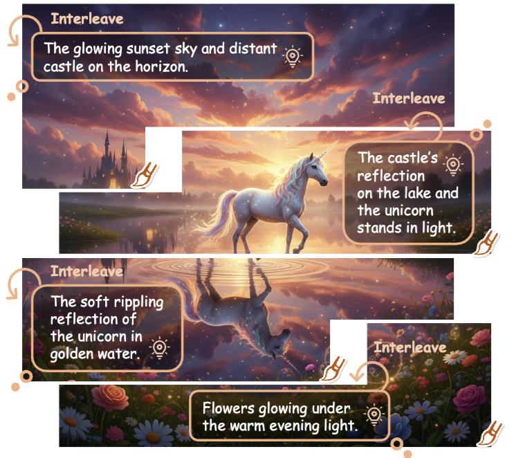
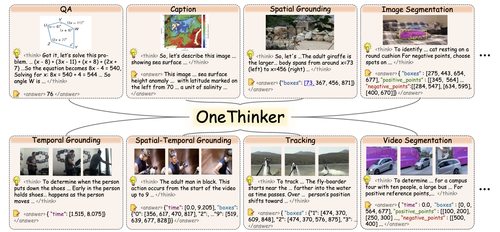
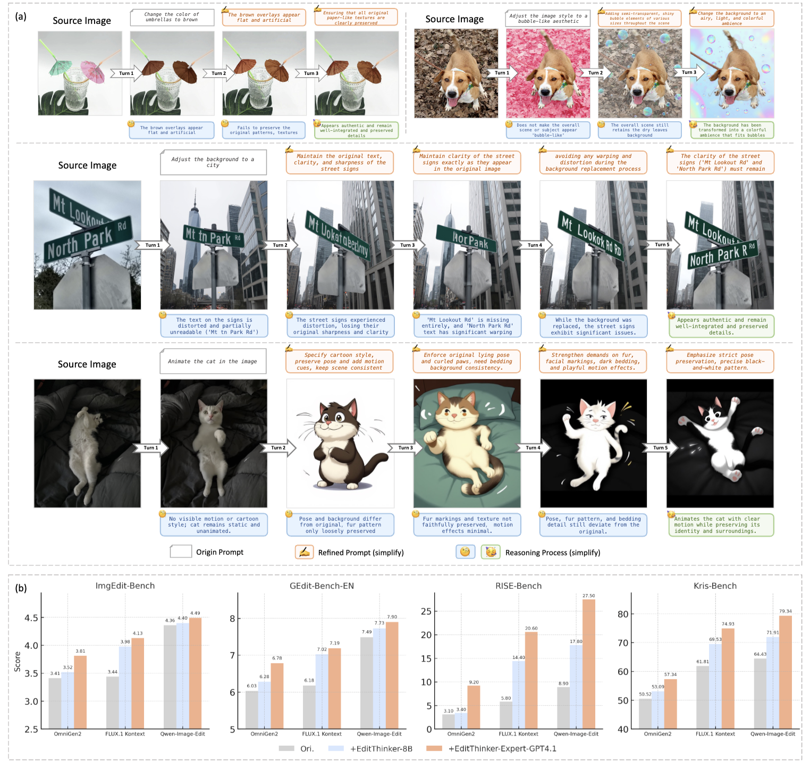
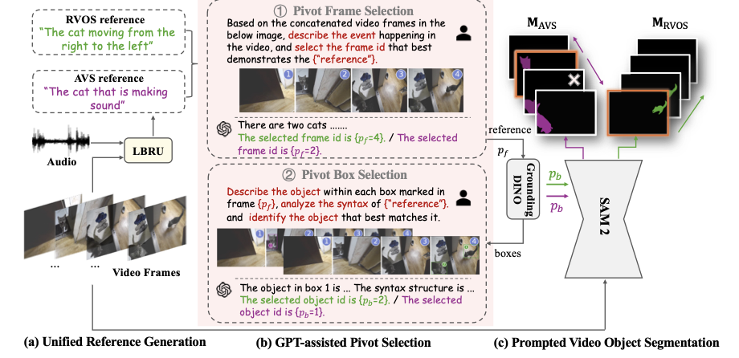
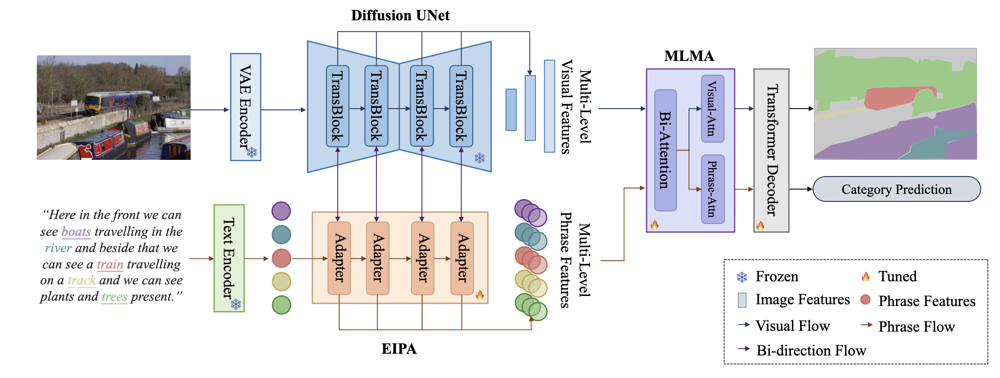

  






I am a second-year Master student at Beihang University supervised by [Prof. Si Liu](https://colalab.net/). Before that, I received my bachelor’s degree in Software Engineering from Beihang University.

My research interests mainly include Multi-modal Learning, Large Language/Vision Models, and Emobodied AI.

# 🔥 News  
- *2026.02*: &nbsp;🎉 Three papers ([Thinking-While-Generating](https://arxiv.org/pdf/2511.16671), [OneThinker](https://arxiv.org/pdf/2512.03043), etc.) are accepted by CVPR 2026.
- *2026.01*:  &nbsp;🎉 One paper is accepted by AAAI 2026.
- *2025.12*:  &nbsp;🔥 Released [EditThinker](https://arxiv.org/pdf/2512.05965), unlocking iterative reasoning for any image editor!
- *2025.09*:  &nbsp;🎉 One paper ([Temporal-R1](https://arxiv.org/pdf/2506.01908?)) is accepted by NeurIPS 2025 Workshop as Oral Presentation.
- *2025.02*: &nbsp;🎉 Two papers ([LLaVA-ST](https://openaccess.thecvf.com/content/CVPR2025/papers/Li_LLaVA-ST_A_Multimodal_Large_Language_Model_for_Fine-Grained_Spatial-Temporal_Understanding_CVPR_2025_paper.pdf), etc.) are accepted by CVPR 2025.
- *2025.01*: &nbsp;🎉 One papers is accepted by ICLR 2025.
- *2025.01*: &nbsp;🎉 One papers is accepted by AAAI 2025.
- *2024.07*: &nbsp;🎉 One papers is accepted by ACMMM 2024.

# 📝 Selected Publications 

CVPR 2026

[Thinking-while-Generating: Interleaving Textual Reasoning throughout Visual Generation](https://arxiv.org/pdf/2511.16671)

Ziyu Guo\*, Renrui Zhang\*†, **Hongyu Li**\*, Manyuan Zhang†, Xinyan Chen, Sifan Wang, Yan Feng, Peng Pei, Pheng-Ann Heng

CVPR 2026

[Onethinker: All-in-one reasoning model for image and video](https://arxiv.org/pdf/2512.03043)

Kaituo Feng, Manyuan Zhang, **Hongyu Li**, Kaixuan Fan, Shuang Chen, Yilei Jiang, Dian Zheng, Peiwen Sun, Yiyuan Zhang, Haoze Sun, Yan Feng, Peng Pei, Xunliang Cai, Xiangyu Yue

Arxiv 2025

[EditThinker: Unlocking Iterative Reasoning for Any Image Editor](https://arxiv.org/pdf/2512.05965)

**Hongyu Li**, Manyuan Zhang, Dian Zheng, Ziyu Guo, Yimeng Jia, Kaituo Feng, Hao Yu, Yexin Liu, Yan Feng, Peng Pei, Xunliang Cai, Linjiang Huang, Hongsheng Li, Si Liu#

CVPR 2025

[LLaVA-ST: A Multimodal Large Language Model for Fine-Grained Spatial-Temporal Understanding](https://openaccess.thecvf.com/content/CVPR2025/papers/Li_LLaVA-ST_A_Multimodal_Large_Language_Model_for_Fine-Grained_Spatial-Temporal_Understanding_CVPR_2025_paper.pdf)

**Hongyu Li**\*, Jinyu Chen\*, Ziyu Wei\*, Shaofei Huang, Tianrui Hui, Jialin Gao#, Xiaoming Wei, Si Liu#

- First MLLM with Spatial-Temporal Fine-Grained Understanding Capacity

AAAI 2025

[AL-Ref-SAM2: Unleashing the Temporal-Spatial Reasoning Capacity of GPT for Training-Free Audio and Language Referenced Video Object Segmentation](https://arxiv.org/pdf/2408.15876)

Shaofei Huang\*, Rui Ling\*, **Hongyu Li**\*, Tianrui Hui#, Zongheng Tang, Xiaoming Wei, Jizhong Han, Si Liu#

- An Agentic Pipeline for Finegrained Lauguage and Audio Referenced Video Segmentation

ACMMM 2024

[Dynamic Prompting of Frozen Text-to-Image Diffusion Models for Panoptic Narrative Grounding](https://arxiv.org/pdf/2409.08251)

**Hongyu Li**\*, Tianrui Hui*, Zihan Ding, Jing Zhang, Bin Ma, Xiaoming Wei, Jizhong Han, Si Liu#

- Adapt T2I Diffusion Model for Text Referenced Dense Image Gounding

# 📖 Educations  
- *Sep 2024* - *Now*, Master Sutdent, School of Artificial Intelligence, Beihang University.
- *Sep 2019* - *Jul 2024*, Bachelor of Software Engineering, Beihang University.

# 📄 Academic Service 
AAAI 2026, CVPR 2026, ICLR 2026, ICML 2026

