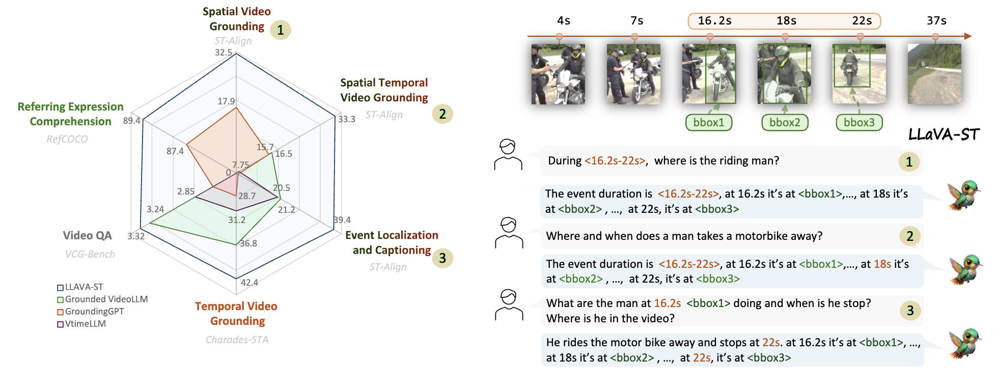








I am a second-year Master student at Beihang University supervised by [Prof. Si Liu](https://colalab.net/). Before that, I received my bachelor’s degree in Software Engineering from Beihang University.

My research interests mainly include Multi-modal Learning, Large Language/Vision Models, and Emobodied AI.

# 🔥 News
- *2026.02*: &nbsp;🎉 Three papers ([Thinking-While-Generating](https://arxiv.org/pdf/2511.16671), [OneThinker](https://arxiv.org/pdf/2512.03043), etc.) are accepted by CVPR 2026.
- *2026.01*:  &nbsp;🎉 One paper is accepted by AAAI 2026.
- *2025.09*:  &nbsp;🎉 One paper ([Temporal-R1](https://arxiv.org/pdf/2506.01908?)) is accepted by NeurIPS 2025 Workshop as Oral Presentation.
- *2025.02*: &nbsp;🎉 Two papers ([LLaVA-ST](https://openaccess.thecvf.com/content/CVPR2025/papers/Li_LLaVA-ST_A_Multimodal_Large_Language_Model_for_Fine-Grained_Spatial-Temporal_Understanding_CVPR_2025_paper.pdf), etc.) are accepted by CVPR 2025.
- *2025.01*: &nbsp;🎉 One papers is accepted by AAAI 2025.
- *2024.07*: &nbsp;🎉 One papers are accepted by ACMMM 2024.

# 📝 Publications 

CVPR 2016

[LLaVA-ST: A Multimodal Large Language Model for Fine-Grained Spatial-Temporal Understanding](https://openaccess.thecvf.com/content/CVPR2025/papers/Li_LLaVA-ST_A_Multimodal_Large_Language_Model_for_Fine-Grained_Spatial-Temporal_Understanding_CVPR_2025_paper.pdf)

**Hongyu Li***, Jinyu Chen*, Ziyu Wei*, Shaofei Huang, Tianrui Hui, Jialin Gao#, Xiaoming Wei, Si Liu#

[**Project**](https://scholar.google.com/citations?view_op=view_citation&hl=zh-CN&user=DhtAFkwAAAAJ&citation_for_view=DhtAFkwAAAAJ:ALROH1vI_8AC) <strong></strong>
- First MLLM with Spatial-Temporal Fine-Grained Understanding Capacity

- [Lorem ipsum dolor sit amet, consectetur adipiscing elit. Vivamus ornare aliquet ipsum, ac tempus justo dapibus sit amet](https://github.com), A, B, C, **CVPR 2020**

# 🎖 Honors and Awards
- *2021.10* Lorem ipsum dolor sit amet, consectetur adipiscing elit. Vivamus ornare aliquet ipsum, ac tempus justo dapibus sit amet. 
- *2021.09* Lorem ipsum dolor sit amet, consectetur adipiscing elit. Vivamus ornare aliquet ipsum, ac tempus justo dapibus sit amet. 

# 📖 Educations
- *2019.06 - 2022.04 (now)*, Lorem ipsum dolor sit amet, consectetur adipiscing elit. Vivamus ornare aliquet ipsum, ac tempus justo dapibus sit amet. 
- *2015.09 - 2019.06*, Lorem ipsum dolor sit amet, consectetur adipiscing elit. Vivamus ornare aliquet ipsum, ac tempus justo dapibus sit amet. 

# 💬 Invited Talks
- *2021.06*, Lorem ipsum dolor sit amet, consectetur adipiscing elit. Vivamus ornare aliquet ipsum, ac tempus justo dapibus sit amet. 
- *2021.03*, Lorem ipsum dolor sit amet, consectetur adipiscing elit. Vivamus ornare aliquet ipsum, ac tempus justo dapibus sit amet.  \| [\[video\]](https://github.com/)

# 💻 Internships
- *2019.05 - 2020.02*, [Lorem](https://github.com/), China.
